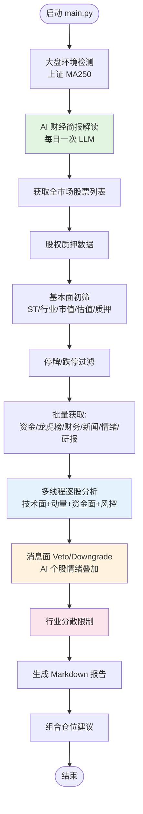
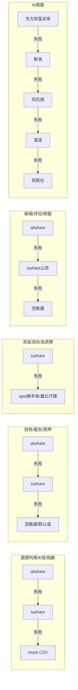
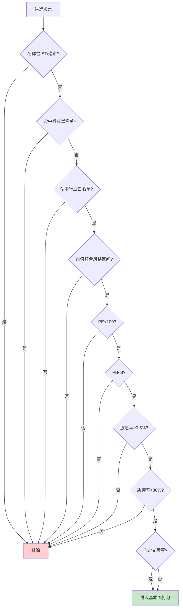
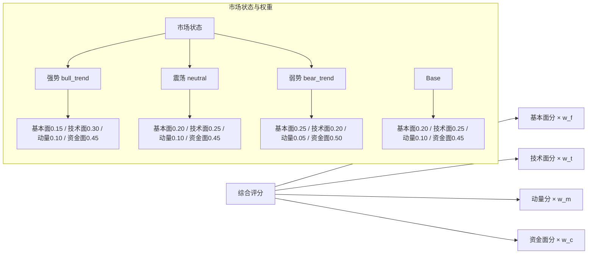
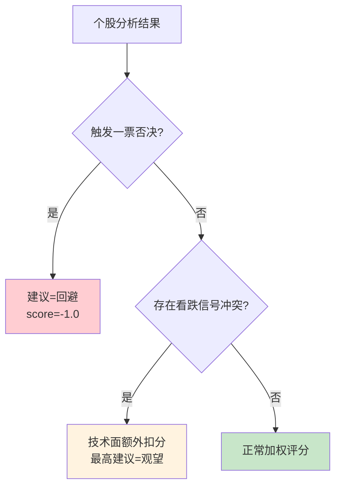
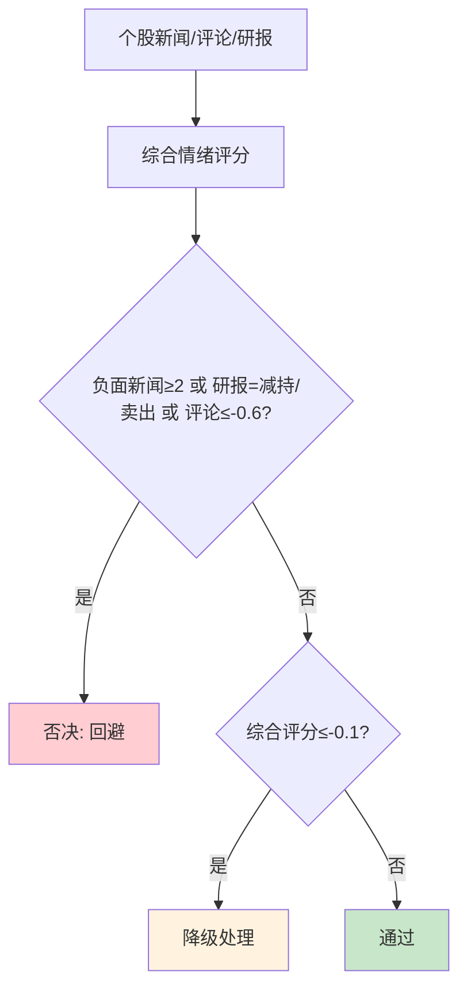
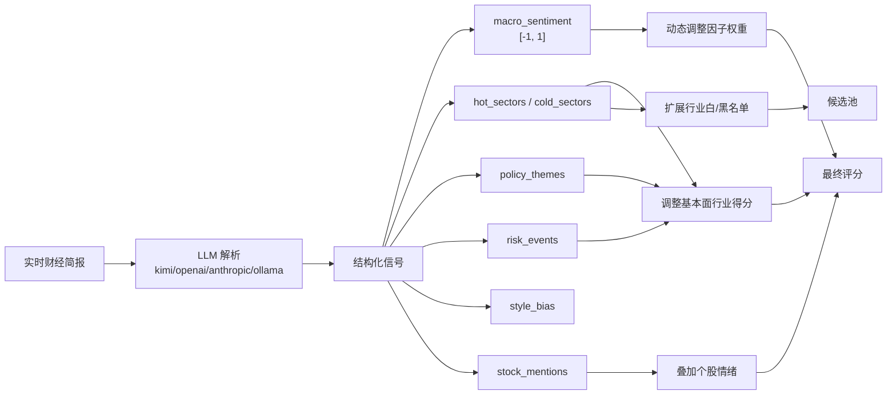
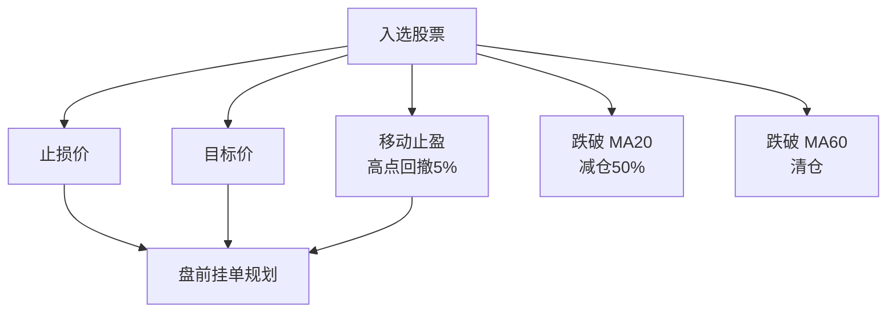
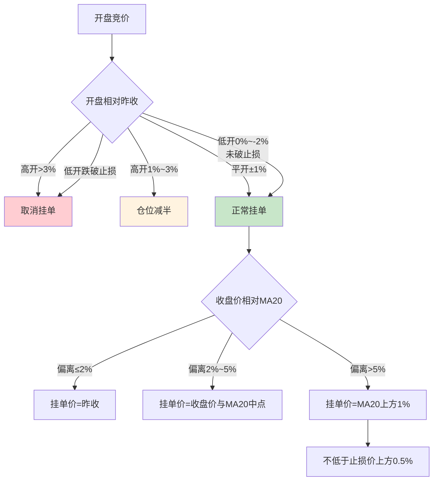
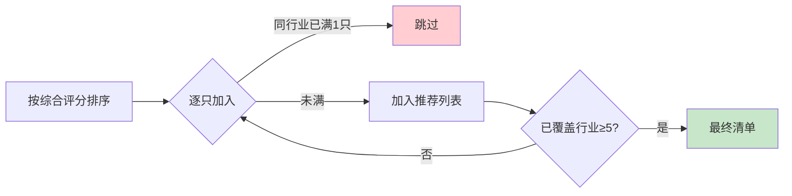

# A-Stock-Advisor 选股策略分析文档

> 版本：基于 `a-stock-advisor` 当前代码（2026-07-18）
> 定位：面向策略维护者/使用者的中文说明，包含流程、规则、阈值与可调配置

---

## 1. 策略概览

本系统是一套 **A 股多因子量化选股 + AI 宏观增强 + 盘前挂单规划** 的完整日报流水线。每日运行一次，输出：

- 推荐股票清单（按综合评分排序）
- 每只股票的技术/资金/基本面摘要
- 风控参数：止损价、目标价、仓位建议
- 盘前挂单规则：挂单价、跳空处理、条件单
- Markdown 报告到 `reports/output/`

核心设计原则：

1. **多源自动降级**：akshare → tushare → mock，任一可用即可运行。
2. **配置驱动**：所有阈值、权重、风控参数集中在 `config/settings.yaml`。
3. **AI 层可选**：LLM 失败或缺 key 时自动退化为纯量化模式。
4. **风控前置**：候选股先过一票否决和信号冲突，再进入评分与仓位计算。

---

## 2. 整体流程图

流程说明：

| 阶段 | 输入 | 输出 | 关键文件/行号 |
|---|---|---|---|
| 大盘环境 | 上证指数 K 线 | 是否在年线上方 | `main.py:171-236` |
| AI 简报 | 实时财经新闻 | 宏观情绪/热门行业/风险事件 | `ai_briefing.py:97-165` |
| 全市场列表 | akshare/tushare/mock | `spot` DataFrame | `data_fetcher.py:84-104` |
| 基本面初筛 | 股票列表 + 质押数据 | 候选池 | `fundamental.py:92-236` |
| 停牌/跌停过滤 | tushare | 清洗后候选池 | `data_fetcher.py:464-498` |
| 批量数据 | 多数据源 | 资金/龙虎榜/财务/新闻 | `data_fetcher.py` 多处 |
| 逐股分析 | 个股 K 线 + spot 行 | 综合评分与风控建议 | `signal_engine_v2.py` / `risk_manager.py` |
| 消息面处理 | 新闻/评论/研报 | veto/downgrade | `news_sentiment.py:335-470` |
| 行业分散 | 评分排序结果 | 最终推荐列表 | `main.py:239-275` |
| 报告输出 | 全部结果 | Markdown + 控制台 | `daily_report.py:12-231` |

---

## 3. 数据源与降级链路

关键点：

- `data_source` 默认 `tushare`，可被环境变量 `DATA_SOURCE` 覆盖。
- 股票列表、K 线、指数数据支持 **akshare → tushare → mock** 三级降级。
- 资金流向依赖 tushare；缺失时回退到 `spot` 中的换手率/量比做 proxy。
- AI 简报主源为东方财富全球快讯，失败时按配置顺序 fallback。

---

## 4. 基本面筛选（FundamentalScreener）

### 4.1 初筛硬条件

硬条件表：

| 规则 | 默认阈值 | 配置项 |
|---|---|---|
| ST / 退市排除 | 名称匹配 | — |
| 行业黑名单 | 教育、培训、互联网、游戏、影视等 | `stock_pool.excluded_sectors` |
| 行业白名单 | 银行、白酒、医药、电力、半导体等 60+ | `stock_pool.preferred_sectors` |
| 市值范围 | conservative: 500亿+；balanced: 100-2000亿；aggressive: 50-1000亿 | `market_cap.*` |
| 绝对市值下限 | ≥30亿 | `market_cap.absolute_min` |
| PE | <50（排除负盈利） | `valuation.max_pe` / `valuation.exclude_negative_pe` |
| PB | <5 | `valuation.max_pb` |
| 股息率 | ≥0.5% | `valuation.min_dividend_yield` |
| 质押避雷 | ≥30% 排除；≥50% 高风险 | `pledge_avoidance.*` |
| 自定义股票 | 强制纳入，但仍受 ST/黑名单/质押约束 | `stock_pool.custom_stocks` |

### 4.2 基本面打分项

| 维度 | 加分/扣分条件 | 幅度 |
|---|---|---|
| 市值 | ≥500亿 / ≥200亿 / ≥100亿 / <100亿 | +0.15 / +0.10 / +0.05 / -0.10 |
| PE | <15 / <25 / <35 / >60 / 亏损 | +0.25 / +0.15 / +0.05 / -0.20 / -0.30 |
| PB | <1.5 / <2.5 / >5 | +0.20 / +0.10 / -0.15 |
| 股息率 | ≥3% / ≥2% | +0.20 / +0.10 |
| 行业偏好 | 命中白名单关键词 | +0.10 |
| PEG | <0.5 / <1.0 / >2.0 | +0.20 / +0.10 / -0.10 |
| ROE | ≥15% / ≥12% | +0.20 / +0.10 |
| 毛利率 | ≥40% | +0.10 |
| 净利率 | ≥15% | +0.10 |
| 负债率 | >70% | -0.10 |
| 筹码集中度 | 股东人数下降>5% / 上升>10% | +0.10 / -0.05 |
| AI 行业调整 | 热门+0.10、冷门-0.10、政策+0.08、风险-0.15（上限±0.20） | — |

---

## 5. 技术面 / 动量 / 资金面评分

### 5.1 多因子权重模型

市场状态由 `MarketRegimeDetector` 根据大盘是否在年线之上判定。

### 5.2 技术面信号清单

主要指标：MA5/MA20/MA60/MA250、MACD、RSI(14)、KDJ(9,3,3)、VOL_MA20、ATR(14)。

| 信号 | 触发条件 | 分数 |
|---|---|---|
| 站上年线 | 收盘 > MA250 | +0.15 |
| 均线多头排列 | 收盘 > MA5 > MA20 > MA60 | +0.25 |
| 均线空头排列 | 收盘 < MA5 < MA20 < MA60 | -0.25 |
| MA60 上行 | 当前 MA60 > 5 日前 MA60 | +0.10 |
| MACD 零上金叉 | DIF 上穿 DEA 且 DIF/DEA > 0 | +0.25 |
| MACD 死叉 | DIF 下穿 DEA | -0.25 |
| MACD 底背离 | 价格新低，DIF 未新低 | +0.15 |
| MACD 顶背离 | 价格新高，DIF 未新高 | -0.15 |
| RSI 超卖 | RSI < 30 | +0.15 |
| RSI 超买 | RSI > 70 | -0.15 |
| KDJ 低位金叉 | K 上穿 D 且 J < 20 | +0.15 |
| KDJ 高位死叉 | K 下穿 D 且 J > 80 | -0.15 |
| 放量突破 | 成交量 > 1.5×VOL_MA20 且 收盘 ≥ 近20日最高×0.98 | +0.20 |
| 缩量回踩 | 成交量 < 0.7×VOL_MA20 且 收盘在 MA20 ±3% 上方 | +0.10 |
| 高位放量滞涨 | 量比 > 2.5 且 涨跌幅 < 2% 且 收盘=最高 | -0.15 |
| 量价齐升 | 放量 + 涨跌幅 > 3% | +0.08 |
| 放量下跌 | 放量 + 涨跌幅 < -3% | -0.12 |
| 箱体突破 | 40日振幅 < 25% 且 突破箱体上沿×0.98 且 量比>1.3 | +0.15 |

### 5.3 动量信号清单

| 周期 | 条件 | 分数 |
|---|---|---|
| 5日涨幅 | >8% / <-8% | +0.15 / -0.20 |
| 5日涨幅 | >3% / <-3% | +0.08 / -0.10 |
| 20日涨幅 | >15% / <-15% | +0.25 / -0.25 |
| 20日涨幅 | >5% / <-5% | +0.12 / -0.12 |
| 60日涨幅 | >30% / <-20% | +0.30 / -0.30 |
| 60日涨幅 | >10% / <0% | +0.15 / -0.10 |
| 趋势一致向上 | r5>0 且 r20>0 且 r60>0 | +0.10 |
| 趋势一致向下 | r5<0 且 r20<0 且 r60<0 | -0.10 |
| 20日最大回撤 | <-10% | -0.15 |
| 20日年化波动 | >25% | -0.10 |
| 强势整理 | r5>0 且 r20>0 且 回撤>-5% | +0.08 |

### 5.4 资金面评分

**Live 模式（有 tushare 数据）：**

| 信号 | 阈值 | 分数 |
|---|---|---|
| 主力大幅流入 | 净流入 > 5000万 | +0.25 |
| 主力流入 | 净流入 > 1000万 | +0.15 |
| 主力大幅流出 | 净流入 < -5000万 | -0.20 |
| 主力流出 | 净流入 < -1000万 | -0.10 |
| 散户抛压 | 散户净流出 < -500万 | +0.15 |
| 散户追涨 | 散户净流出 > 1000万 | -0.10 |
| 净流入占比 | >5% / <-5% | +0.10 / -0.10 |
| 龙虎榜机构净买 | >5000万 / >1000万 / <-3000万 | +0.20 / +0.10 / -0.15 |
| 龙虎榜净额 | 正 / 负 | +0.05 / -0.05 |
| 机构席位净买 | 正 / 负 | +0.10 / -0.05 |

**Proxy/Mock/回测模式（无 tushare 资金数据）：**

| 信号 | 条件 | 分数 |
|---|---|---|
| 换手率适中 | 2% ~ 10% | +0.05 |
| 换手过低 | <0.5% | -0.05 |
| 换手过高 | >20% | -0.10 |
| 量比活跃 | 1.5 ~ 3 | +0.05 |
| 量比过低 | <0.5 | -0.05 |
| 量比异常 | >3 | 标记 |

---

## 6. 一票否决与信号冲突

### 6.1 一票否决规则

配置于 `veto_rules.rules`：

1. 趋势向下（均线空头排列）
2. 主力大幅流出
3. MACD 顶背离/死叉
4. 均线空头排列
5. RSI 超买

触发后该股票建议直接变为 **回避**，综合评分强制为 `-1.0`。

### 6.2 信号冲突处理

看跌优先信号：MACD 顶背离、MACD 死叉、均线空头排列、RSI 超买、KDJ 高位死叉、高位放量滞涨。

- 技术面额外惩罚：`0.15 × 看跌信号数量`
- 建议等级最高只能到 **观望**
- `force_downgrade_when_conflict=true` 时再降一级

---

## 7. 消息面与 AI 宏观层

### 7.1 新闻/情绪/研报否决与降级

评分来源权重：新闻 0.5、评论情绪 0.3、研报评级 0.2。

负面关键词库：立案、调查、处罚、退市、ST、亏损、减持、解禁、诉讼、债务违约、评级下调等 30+。

### 7.2 AI 宏观简报信号映射

AI 调整幅度限制：

- 单因子权重偏移：±15%
- 基本面行业总调整：±0.20
- 个股情绪叠加：正面 +0.15，负面 -0.20

LLM 调用失败或 JSON 解析失败时，整个 AI 层返回 `None`，流程降级为纯量化模式。

---

## 8. 风控与仓位管理

### 8.1 个股风控参数

| 项目 | 方式 | 默认阈值/说明 |
|---|---|---|
| 止损 | `support_resistance` 优先 | 近20日低点与 MA20 较高者，但不高于当前价；若太远则回退 -4% |
| 固定止损 | `fixed` | -4% |
| 目标价 | `support_resistance` | 近60日高点与 +30% 取较小者 |
| 移动止盈 | 高点回撤 | 5% |
| MA20 减仓 | 跌破 MA20 | 减仓 50% |
| MA60 清仓 | 跌破 MA60 | 清仓 |

### 8.2 仓位建议

| 综合评分 | 建议仓位 |
|---|---|
| ≥0.6 | 30%（极度看好上限） |
| ≥0.4 | 20%（单股上限） |
| ≥0.2 | 15% |
| ≥0 | 10% |
| <0 | 0% |

组合层面：

- 最大持仓：10 只
- 最小持仓：5 只
- 现金储备：15%
- 平均仓位 = (100% - 15%) / 目标持股数

### 8.3 盘前挂单规则

---

## 9. 行业分散与选股上限

配置：

| 配置项 | 默认值 |
|---|---|
| `max_holdings` | 10 |
| `min_holdings` | 5 |
| `max_single_position` | 20% |
| `max_conviction_position` | 30% |
| `max_sector_position` | 30% |
| `max_sector_holdings` | 1（推荐列表单行业最多1只） |
| `min_sectors_in_recommendation` | 5 |
| `cash_reserve` | 15% |

---

## 10. 关键配置速查

核心配置文件：`config/settings.yaml`

| 配置块 | 关键字段 | 默认值/说明 |
|---|---|---|
| 全局 | `investment_style` | balanced |
| 数据源 | `data_source` | tushare |
| 股票池 | `preferred_sectors` / `excluded_sectors` / `custom_stocks` | 行业白/黑名单、自选 |
| 市值 | `market_cap.*` | 按风格区间 |
| 估值 | `max_pe` / `max_pb` / `min_dividend_yield` / `exclude_negative_pe` | 50 / 5 / 0.5% / true |
| 质押 | `pledge_avoidance.threshold_pct` | 30% |
| 技术指标 | `ma_*` / `macd_*` / `rsi_*` / `kdj_*` | 详见配置文件 |
| 新闻情绪 | `news_sentiment.*` | 权重、否决阈值、关键词 |
| 信号权重 | `signal_weights.base` / `dynamic.*` | 基础 + 动态权重 |
| 一票否决 | `veto_rules.rules` | 5 条 |
| 信号冲突 | `bearish_priority_signals` | 6 个看跌信号 |
| 风控 | `risk_management.*` | 止损止盈方式与阈值 |
| 仓位管理 | `position_management.*` | 持仓上下限、行业上限 |
| 盘前挂单 | `pre_market.*` | 跳空阈值、MA20 偏离阈值 |
| AI 简报 | `ai_briefing.*` | LLM 配置、新闻源、调整幅度 |

---

## 11. 回测与实盘差异

| 维度 | 实盘 | 回测 |
|---|---|---|
| 新闻/情绪否决 | 启用 | 禁用（避免未来函数） |
| 资金面 | tushare moneyflow / 龙虎榜 / 机构席位 | 换手率 + 量比 proxy |
| 股权质押 | 最新数据 | 用最新数据近似历史 |
| AI 简报 | 调用 LLM | 可按配置禁用或模拟 |

---

## 12. 维护建议

1. **定期校准阈值**：PE/PB/市值/股息率等阈值随市场环境变化需回顾。
2. **监控数据降级**：akshare/tushare 接口变更会导致降级，应查看日志确认。
3. **AI 层稳定性**：LLM 输出 JSON 格式偶有偏差，建议对 `ai_briefing.py` 解析失败做统计。
4. **回测对齐**：新增 live-only 信号时，务必补充 proxy 打分逻辑，避免回测失真。
5. **行业白名单**：A 股行业命名变化较快，需保持 `preferred_sectors` 关键词更新。

---

> 本文档基于代码自动生成分析，关键引用见各章节文件/行号标注。如需更新，请同步修改本文件。
